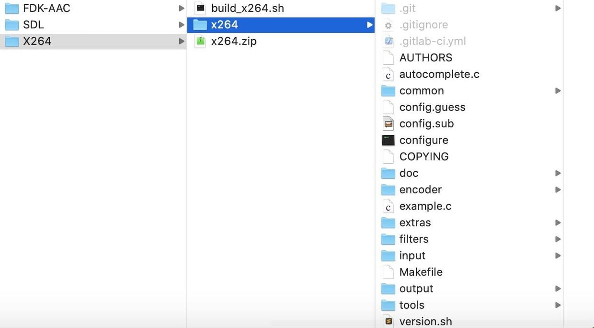

# iOS编译FFmpeg有两种方式
> 1.下载编译好的[FFmpeg静态库](https://sourceforge.net/projects/ffmpeg-ios/files/ffmpeg-ios-master.tar.bz2/download?use_mirror=versaweb)拖入Xcode工程中
> 2.编译[ffmpeg源码](http://ffmpeg.org/download.html#releases)，可以更改源码，通过脚本编译自己的架构，更为灵活,包含fdk-aac库，x264,sdl2等。

本文介绍自己编译sdl2，fdk-aac,x264，ffmpeg源码集成到Xcode工程中，其中fdk-aac，x264嵌套编译进ffmpeg中,并使用ffmpeg进行软解码，SDL播放音频，OPenGLES渲染视频来实现一个简单播放器

#1.编译SDL

##I.从[SDL官网](https://www.libsdl.org/download-2.0.php)下载SDL源码(百度网盘放一份[2.0.16])(链接:https://pan.baidu.com/s/11JeLkg82rdjnaBCD7q3_wg  密码:hv8j)

##II.解压后打开Xcode文件夹中的SDL.xcodeproj,选择静态库Static Library-iOS,Build选择Any iOS Devices(arm64,armv7)


##III.Cmd + B编译后，在Products文件夹下面生成libSDL2.a静态库放入lib文件夹中，头文件放入include文件夹中,后续拖入Xcode工程中使用


#2.编译FDK-AAC

##I.从[官网](https://sourceforge.net/p/opencore-amr/fdk-aac/ci/v2.0.2/tree/)下载稳定的FDK-AAC版本2.0.2源码(百度网盘放一份链接:https://pan.baidu.com/s/1dA7vRHxku6ox06vSzP1Xbg  密码:w4bu),直接下载或```git clone git://git.code.sf.net/p/opencore-amr/fdk-aac opencore-amr-fdk-aac```,opencore-amr-fdk-aac修改文件夹名称为fdk-aac-2.0.2


##II.在同级目录下创建脚本文件build_aac.h,文件内容如下,在终端执行此脚本```./build_aac.h```,若报错zsh: permission denied: ./build_aac.sh，则可能会存在权限问题，执行chmod -R 777 build_aac.sh命令即可
```
CONFIGURE_FLAGS="--enable-static --with-pic=yes --disable-shared"
#指定编译平台
ARCHS="arm64 armv7"
# 源码位置
SOURCE="fdk-aac-2.0.2"
FAT="fdk-aac-ios"
SCRATCH="scratch"
# must be an absolute path
THIN=`pwd`/"thin"
COMPILE="y"
LIPO="y"

if [ "$*" ]
then
    if [ "$*" = "lipo" ]
    then
        COMPILE=
    else
        ARCHS="$*"
        if [ $# -eq 1 ]
        then
            # skip lipo
            LIPO=
        fi
    fi
fi

if [ "$COMPILE" ]
then
    CWD=`pwd`
    for ARCH in $ARCHS
    do
        echo "building $ARCH..."
        mkdir -p "$SCRATCH/$ARCH"
        cd "$SCRATCH/$ARCH"
        CFLAGS="-arch $ARCH"
        if [ "$ARCH" = "i386" -o "$ARCH" = "x86_64" ]
        then
            PLATFORM="iPhoneSimulator"
            CPU=
            if [ "$ARCH" = "x86_64" ]
            then
                CFLAGS="$CFLAGS -mios-simulator-version-min=7.0"
                HOST="--host=x86_64-apple-darwin"
            else
                CFLAGS="$CFLAGS -mios-simulator-version-min=7.0"
                HOST="--host=i386-apple-darwin"
            fi
        else
            PLATFORM="iPhoneOS"
            if [ $ARCH = arm64 ]
            then
                HOST="--host=aarch64-apple-darwin"
            else
                HOST="--host=arm-apple-darwin"
            fi
            CFLAGS="$CFLAGS -fembed-bitcode"
        fi

        XCRUN_SDK=`echo $PLATFORM | tr '[:upper:]' '[:lower:]'`
        CC="xcrun -sdk $XCRUN_SDK clang -Wno-error=unused-command-line-argument-hard-error-in-future"
        AS="$CWD/$SOURCE/extras/gas-preprocessor.pl $CC"
        CXXFLAGS="$CFLAGS"
        LDFLAGS="$CFLAGS"

        $CWD/$SOURCE/configure \
            $CONFIGURE_FLAGS \
            $HOST \
            $CPU \
            CC="$CC" \
            CXX="$CC" \
            CPP="$CC -E" \
            AS="$AS" \
            CFLAGS="$CFLAGS" \
            LDFLAGS="$LDFLAGS" \
            CPPFLAGS="$CFLAGS" \
            --prefix="$THIN/$ARCH" || exit 1
        make -j8 install || exit 1
        cd $CWD
    done
fi

#合并各个架构平台的库文件
if [ "$LIPO" ]
then
    echo "building fat binaries..."
    mkdir -p $FAT/lib
    set - $ARCHS
    CWD=`pwd`
    cd $THIN/$1/lib
    for LIB in *.a
    do
        cd $CWD
        lipo -create `find $THIN -name $LIB` -output $FAT/lib/$LIB
    done
    
    cd $CWD
    cp -rf $THIN/$1/include $FAT
fi
```

若报错```fdk-aac-2.0.2/configure: No such file or directory```，则用我网盘中的解压文件，里面包含了configure执行文件，执行```./build.sh```后，


##III.编译完成后，在fdk-aac-ios文件夹中就会生成include和lib文件夹


#3.编译X264

##I.访问[X264官网](https://www.videolan.org/developers/x264.html),通过```https://www.videolan.org/developers/x264.html```下载X264源码(百度网盘放一份链接:链接:https://pan.baidu.com/s/1FpiV4qrErOBdgoVBYYIAbw  密码:wef1)
##II.在同级目录下新建build_x264.sh脚本文件，文件内容如下，执行```./build_x264.sh```,若有权限问题，执行```chmod -R 777 build_x264.sh```

```
CONFIGURE_FLAGS="--enable-static --enable-pic --disable-cli --disable-shared"
# 指定架构平台
ARCHS="arm64 armv7"
#源码位置
SOURCE="x264"
FAT="x264-iOS"
SCRATCH="scratch-x264"
THIN=`pwd`/"thin-x264"

COMPILE="y"
LIPO="y"

if [ "$*" ]
then
    if [ "$*" = "lipo" ]
    then
        COMPILE=
    else
        ARCHS="$*"
        if [ $# -eq 1 ]
        then
            LIPO=
        fi
    fi
fi

if [ "$COMPILE" ]
then
    CWD=`pwd`
    for ARCH in $ARCHS
    do
        echo "building $ARCH..."
        mkdir -p "$SCRATCH/$ARCH"
        cd "$SCRATCH/$ARCH"
        CFLAGS="-arch $ARCH"
        ASFLAGS=
        if [ "$ARCH" = "i386" -o "$ARCH" = "x86_64" ]
        then
            PLATFORM="iPhoneSimulator"
            CPU=
            if [ "$ARCH" = "x86_64" ]
            then
                CFLAGS="$CFLAGS -mios-simulator-version-min=9.0"
                HOST=
            else
                CFLAGS="$CFLAGS -mios-simulator-version-min=9.0"
                HOST="--host=i386-apple-darwin"
            fi
        else
            PLATFORM="iPhoneOS"
            if [ $ARCH = "arm64" ]
            then
                HOST="--host=aarch64-apple-darwin"
                XARCH="-arch aarch64"
            else
                HOST="--host=arm-apple-darwin"
                XARCH="-arch arm"
            fi

            CFLAGS="$CFLAGS -fembed-bitcode -mios-version-min=9.0"
            ASFLAGS="$CFLAGS"
        fi
  
        XCRUN_SDK=`echo $PLATFORM | tr '[:upper:]' '[:lower:]'`
        CC="xcrun -sdk $XCRUN_SDK clang"
        if [ $PLATFORM = "iPhoneOS" ]
        then
            export AS="$CWD/$SOURCE/tools/gas-preprocessor.pl $XARCH -- $CC"
        else
            export -n AS
        fi
        CXXFLAGS="$CFLAGS"
        LDFLAGS="$CFLAGS"
        CC=$CC $CWD/$SOURCE/configure \
            $CONFIGURE_FLAGS \
            $HOST \
            --extra-cflags="$CFLAGS" \
            --extra-asflags="$ASFLAGS" \
            --extra-ldflags="$LDFLAGS" \
            --prefix="$THIN/$ARCH" || exit 1
            
        make -j8 install || exit 1
        cd $CWD
    done
fi

if [ "$LIPO" ]
then
    echo "building fat binaries..."
    mkdir -p $FAT/lib
    set - $ARCHS
    CWD=`pwd`
    cd $THIN/$1/lib
    for LIB in *.a
    do
        cd $CWD
        lipo -create `find $THIN -name $LIB` -output $FAT/lib/$LIB
    done

    cd $CWD
    cp -rf $THIN/$1/include $FAT
fi
```
##III.编译完成后，库文件在文件夹x264-iOS中


#4.编译FFmpeg源码并嵌套fdk-aac，x264

##I.从官网下载[FFmpeg_4.3.2版本源码](http://ffmpeg.org/releases/ffmpeg-4.3.2.tar.xz)(百度网盘放一份，链接:https://pan.baidu.com/s/11ElqpUwByUG6565W09-unA  密码:9k9c)

##II.下载[gas-preprocessor](https://github.com/libav/gas-preprocessor)
> 拷贝gas-preprocessor.pl到/usr/local/bin目录下
添加可读可写可执行权限，后面运行 FFmpeg-iOS-build-script 这个自动编译脚本需要 gas-preprocessor
```sudo chmod 777 /usr/local/bin/gas-preprocessor.pl```

##III.安装yasm```brew install yasm```

##IV.下载自动编译脚本[FFmpeg-iOS-build-script](https://github.com/kewlbear/FFmpeg-iOS-build-script)
修改build-ffmpeg.sh文件为最新的版本4.3.2，修改CONFIGURE_FLAGS值中增加禁止生成可执行文件ffmpeg,ffplay,ffprobe，fdk-aac需要增加--enable-nonfree选项,fdk-aac和x264文件绝对路径要一致


```
# absolute path to x264 library
#X264=`pwd`/fat-x264
X264=`pwd`/X264/x264-iOS

#FDK_AAC=`pwd`/../fdk-aac-build-script-for-iOS/fdk-aac-ios
FDK_AAC=`pwd`/FDK-AAC/fdk-aac-ios

CONFIGURE_FLAGS="--enable-cross-compile --disable-debug --disable-programs \
                 --disable-doc --enable-pic --enable-nonfree --disable-ffmpeg --disable-ffplay --disable-ffprobe"
```
##V.在当前目录下执行./build-ffmpeg.sh,编译完后生成FFmpeg-iOS文件夹，include中是头文件和lib中是静态库.a文件

配置参数可精简和优化ffmpeg,在ffmpeg目录中，终端执行./configure --help列出全部参数
```
Help options:
  --help                   print this message
  --quiet                  Suppress showing informative output
  --list-decoders          show all available decoders
  --list-encoders          show all available encoders
  --list-hwaccels          show all available hardware accelerators
  --list-demuxers          show all available demuxers
  --list-muxers            show all available muxers
  --list-parsers           show all available parsers
  --list-protocols         show all available protocols
  --list-bsfs              show all available bitstream filters
  --list-indevs            show all available input devices
  --list-outdevs           show all available output devices
  --list-filters           show all available filters

Standard options:
  --logfile=FILE           log tests and output to FILE [ffbuild/config.log]
  --disable-logging        do not log configure debug information
  --fatal-warnings         fail if any configure warning is generated
  --prefix=PREFIX          install in PREFIX [/usr/local]
  --bindir=DIR             install binaries in DIR [PREFIX/bin]
  --datadir=DIR            install data files in DIR [PREFIX/share/ffmpeg]
  --docdir=DIR             install documentation in DIR [PREFIX/share/doc/ffmpeg]
  --libdir=DIR             install libs in DIR [PREFIX/lib]
  --shlibdir=DIR           install shared libs in DIR [LIBDIR]
  --incdir=DIR             install includes in DIR [PREFIX/include]
  --mandir=DIR             install man page in DIR [PREFIX/share/man]
  --pkgconfigdir=DIR       install pkg-config files in DIR [LIBDIR/pkgconfig]
  --enable-rpath           use rpath to allow installing libraries in paths
                           not part of the dynamic linker search path
                           use rpath when linking programs (USE WITH CARE)
  --install-name-dir=DIR   Darwin directory name for installed targets

Licensing options:
  --enable-gpl             allow use of GPL code, the resulting libs
                           and binaries will be under GPL [no]
  --enable-version3        upgrade (L)GPL to version 3 [no]
  --enable-nonfree         allow use of nonfree code, the resulting libs
                           and binaries will be unredistributable [no]

Configuration options:
  --disable-static         do not build static libraries [no]
  --enable-shared          build shared libraries [no]
  --enable-small           optimize for size instead of speed
  --disable-runtime-cpudetect disable detecting CPU capabilities at runtime (smaller binary)
  --enable-gray            enable full grayscale support (slower color)
  --disable-swscale-alpha  disable alpha channel support in swscale
  --disable-all            disable building components, libraries and programs
  --disable-autodetect     disable automatically detected external libraries [no]

Program options:
  --disable-programs       do not build command line programs
  --disable-ffmpeg         disable ffmpeg build
  --disable-ffplay         disable ffplay build
  --disable-ffprobe        disable ffprobe build

Documentation options:
  --disable-doc            do not build documentation
  --disable-htmlpages      do not build HTML documentation pages
  --disable-manpages       do not build man documentation pages
  --disable-podpages       do not build POD documentation pages
  --disable-txtpages       do not build text documentation pages

Component options:
  --disable-avdevice       disable libavdevice build
  --disable-avcodec        disable libavcodec build
  --disable-avformat       disable libavformat build
  --disable-swresample     disable libswresample build
  --disable-swscale        disable libswscale build
  --disable-postproc       disable libpostproc build
  --disable-avfilter       disable libavfilter build
  --enable-avresample      enable libavresample build (deprecated) [no]
  --disable-pthreads       disable pthreads [autodetect]
  --disable-w32threads     disable Win32 threads [autodetect]
  --disable-os2threads     disable OS/2 threads [autodetect]
  --disable-network        disable network support [no]
  --disable-dct            disable DCT code
  --disable-dwt            disable DWT code
  --disable-error-resilience disable error resilience code
  --disable-lsp            disable LSP code
  --disable-lzo            disable LZO decoder code
  --disable-mdct           disable MDCT code
  --disable-rdft           disable RDFT code
  --disable-fft            disable FFT code
  --disable-faan           disable floating point AAN (I)DCT code
  --disable-pixelutils     disable pixel utils in libavutil

Individual component options:
  --disable-everything     disable all components listed below
  --disable-encoder=NAME   disable encoder NAME
  --enable-encoder=NAME    enable encoder NAME
  --disable-encoders       disable all encoders
  --disable-decoder=NAME   disable decoder NAME
  --enable-decoder=NAME    enable decoder NAME
  --disable-decoders       disable all decoders
  --disable-hwaccel=NAME   disable hwaccel NAME
  --enable-hwaccel=NAME    enable hwaccel NAME
  --disable-hwaccels       disable all hwaccels
  --disable-muxer=NAME     disable muxer NAME
  --enable-muxer=NAME      enable muxer NAME
  --disable-muxers         disable all muxers
  --disable-demuxer=NAME   disable demuxer NAME
  --enable-demuxer=NAME    enable demuxer NAME
  --disable-demuxers       disable all demuxers
  --enable-parser=NAME     enable parser NAME
  --disable-parser=NAME    disable parser NAME
  --disable-parsers        disable all parsers
  --enable-bsf=NAME        enable bitstream filter NAME
  --disable-bsf=NAME       disable bitstream filter NAME
  --disable-bsfs           disable all bitstream filters
  --enable-protocol=NAME   enable protocol NAME
  --disable-protocol=NAME  disable protocol NAME
  --disable-protocols      disable all protocols
  --enable-indev=NAME      enable input device NAME
  --disable-indev=NAME     disable input device NAME
  --disable-indevs         disable input devices
  --enable-outdev=NAME     enable output device NAME
  --disable-outdev=NAME    disable output device NAME
  --disable-outdevs        disable output devices
  --disable-devices        disable all devices
  --enable-filter=NAME     enable filter NAME
  --disable-filter=NAME    disable filter NAME
  --disable-filters        disable all filters

External library support:

  Using any of the following switches will allow FFmpeg to link to the
  corresponding external library. All the components depending on that library
  will become enabled, if all their other dependencies are met and they are not
  explicitly disabled. E.g. --enable-libwavpack will enable linking to
  libwavpack and allow the libwavpack encoder to be built, unless it is
  specifically disabled with --disable-encoder=libwavpack.

  Note that only the system libraries are auto-detected. All the other external
  libraries must be explicitly enabled.

  Also note that the following help text describes the purpose of the libraries
  themselves, not all their features will necessarily be usable by FFmpeg.

  --disable-alsa           disable ALSA support [autodetect]
  --disable-appkit         disable Apple AppKit framework [autodetect]
  --disable-avfoundation   disable Apple AVFoundation framework [autodetect]
  --enable-avisynth        enable reading of AviSynth script files [no]
  --disable-bzlib          disable bzlib [autodetect]
  --disable-coreimage      disable Apple CoreImage framework [autodetect]
  --enable-chromaprint     enable audio fingerprinting with chromaprint [no]
  --enable-frei0r          enable frei0r video filtering [no]
  --enable-gcrypt          enable gcrypt, needed for rtmp(t)e support
                           if openssl, librtmp or gmp is not used [no]
  --enable-gmp             enable gmp, needed for rtmp(t)e support
                           if openssl or librtmp is not used [no]
  --enable-gnutls          enable gnutls, needed for https support
                           if openssl, libtls or mbedtls is not used [no]
  --disable-iconv          disable iconv [autodetect]
  --enable-jni             enable JNI support [no]
  --enable-ladspa          enable LADSPA audio filtering [no]
  --enable-libaom          enable AV1 video encoding/decoding via libaom [no]
  --enable-libaribb24      enable ARIB text and caption decoding via libaribb24 [no]
  --enable-libass          enable libass subtitles rendering,
                           needed for subtitles and ass filter [no]
  --enable-libbluray       enable BluRay reading using libbluray [no]
  --enable-libbs2b         enable bs2b DSP library [no]
  --enable-libcaca         enable textual display using libcaca [no]
  --enable-libcelt         enable CELT decoding via libcelt [no]
  --enable-libcdio         enable audio CD grabbing with libcdio [no]
  --enable-libcodec2       enable codec2 en/decoding using libcodec2 [no]
  --enable-libdav1d        enable AV1 decoding via libdav1d [no]
  --enable-libdavs2        enable AVS2 decoding via libdavs2 [no]
  --enable-libdc1394       enable IIDC-1394 grabbing using libdc1394
                           and libraw1394 [no]
  --enable-libfdk-aac      enable AAC de/encoding via libfdk-aac [no]
  --enable-libflite        enable flite (voice synthesis) support via libflite [no]
  --enable-libfontconfig   enable libfontconfig, useful for drawtext filter [no]
  --enable-libfreetype     enable libfreetype, needed for drawtext filter [no]
  --enable-libfribidi      enable libfribidi, improves drawtext filter [no]
  --enable-libglslang      enable GLSL->SPIRV compilation via libglslang [no]
  --enable-libgme          enable Game Music Emu via libgme [no]
  --enable-libgsm          enable GSM de/encoding via libgsm [no]
  --enable-libiec61883     enable iec61883 via libiec61883 [no]
  --enable-libilbc         enable iLBC de/encoding via libilbc [no]
  --enable-libjack         enable JACK audio sound server [no]
  --enable-libklvanc       enable Kernel Labs VANC processing [no]
  --enable-libkvazaar      enable HEVC encoding via libkvazaar [no]
  --enable-liblensfun      enable lensfun lens correction [no]
  --enable-libmodplug      enable ModPlug via libmodplug [no]
  --enable-libmp3lame      enable MP3 encoding via libmp3lame [no]
  --enable-libopencore-amrnb enable AMR-NB de/encoding via libopencore-amrnb [no]
  --enable-libopencore-amrwb enable AMR-WB decoding via libopencore-amrwb [no]
  --enable-libopencv       enable video filtering via libopencv [no]
  --enable-libopenh264     enable H.264 encoding via OpenH264 [no]
  --enable-libopenjpeg     enable JPEG 2000 de/encoding via OpenJPEG [no]
  --enable-libopenmpt      enable decoding tracked files via libopenmpt [no]
  --enable-libopus         enable Opus de/encoding via libopus [no]
  --enable-libpulse        enable Pulseaudio input via libpulse [no]
  --enable-librabbitmq     enable RabbitMQ library [no]
  --enable-librav1e        enable AV1 encoding via rav1e [no]
  --enable-librsvg         enable SVG rasterization via librsvg [no]
  --enable-librubberband   enable rubberband needed for rubberband filter [no]
  --enable-librtmp         enable RTMP[E] support via librtmp [no]
  --enable-libshine        enable fixed-point MP3 encoding via libshine [no]
  --enable-libsmbclient    enable Samba protocol via libsmbclient [no]
  --enable-libsnappy       enable Snappy compression, needed for hap encoding [no]
  --enable-libsoxr         enable Include libsoxr resampling [no]
  --enable-libspeex        enable Speex de/encoding via libspeex [no]
  --enable-libsrt          enable Haivision SRT protocol via libsrt [no]
  --enable-libssh          enable SFTP protocol via libssh [no]
  --enable-libtensorflow   enable TensorFlow as a DNN module backend
                           for DNN based filters like sr [no]
  --enable-libtesseract    enable Tesseract, needed for ocr filter [no]
  --enable-libtheora       enable Theora encoding via libtheora [no]
  --enable-libtls          enable LibreSSL (via libtls), needed for https support
                           if openssl, gnutls or mbedtls is not used [no]
  --enable-libtwolame      enable MP2 encoding via libtwolame [no]
  --enable-libv4l2         enable libv4l2/v4l-utils [no]
  --enable-libvidstab      enable video stabilization using vid.stab [no]
  --enable-libvmaf         enable vmaf filter via libvmaf [no]
  --enable-libvo-amrwbenc  enable AMR-WB encoding via libvo-amrwbenc [no]
  --enable-libvorbis       enable Vorbis en/decoding via libvorbis,
                           native implementation exists [no]
  --enable-libvpx          enable VP8 and VP9 de/encoding via libvpx [no]
  --enable-libwavpack      enable wavpack encoding via libwavpack [no]
  --enable-libwebp         enable WebP encoding via libwebp [no]
  --enable-libx264         enable H.264 encoding via x264 [no]
  --enable-libx265         enable HEVC encoding via x265 [no]
  --enable-libxavs         enable AVS encoding via xavs [no]
  --enable-libxavs2        enable AVS2 encoding via xavs2 [no]
  --enable-libxcb          enable X11 grabbing using XCB [autodetect]
  --enable-libxcb-shm      enable X11 grabbing shm communication [autodetect]
  --enable-libxcb-xfixes   enable X11 grabbing mouse rendering [autodetect]
  --enable-libxcb-shape    enable X11 grabbing shape rendering [autodetect]
  --enable-libxvid         enable Xvid encoding via xvidcore,
                           native MPEG-4/Xvid encoder exists [no]
  --enable-libxml2         enable XML parsing using the C library libxml2, needed
                           for dash demuxing support [no]
  --enable-libzimg         enable z.lib, needed for zscale filter [no]
  --enable-libzmq          enable message passing via libzmq [no]
  --enable-libzvbi         enable teletext support via libzvbi [no]
  --enable-lv2             enable LV2 audio filtering [no]
  --disable-lzma           disable lzma [autodetect]
  --enable-decklink        enable Blackmagic DeckLink I/O support [no]
  --enable-mbedtls         enable mbedTLS, needed for https support
                           if openssl, gnutls or libtls is not used [no]
  --enable-mediacodec      enable Android MediaCodec support [no]
  --enable-mediafoundation enable encoding via MediaFoundation [auto]
  --enable-libmysofa       enable libmysofa, needed for sofalizer filter [no]
  --enable-openal          enable OpenAL 1.1 capture support [no]
  --enable-opencl          enable OpenCL processing [no]
  --enable-opengl          enable OpenGL rendering [no]
  --enable-openssl         enable openssl, needed for https support
                           if gnutls, libtls or mbedtls is not used [no]
  --enable-pocketsphinx    enable PocketSphinx, needed for asr filter [no]
  --disable-sndio          disable sndio support [autodetect]
  --disable-schannel       disable SChannel SSP, needed for TLS support on
                           Windows if openssl and gnutls are not used [autodetect]
  --disable-sdl2           disable sdl2 [autodetect]
  --disable-securetransport disable Secure Transport, needed for TLS support
                           on OSX if openssl and gnutls are not used [autodetect]
  --enable-vapoursynth     enable VapourSynth demuxer [no]
  --enable-vulkan          enable Vulkan code [no]
  --disable-xlib           disable xlib [autodetect]
  --disable-zlib           disable zlib [autodetect]

  The following libraries provide various hardware acceleration features:
  --disable-amf            disable AMF video encoding code [autodetect]
  --disable-audiotoolbox   disable Apple AudioToolbox code [autodetect]
  --enable-cuda-nvcc       enable Nvidia CUDA compiler [no]
  --disable-cuda-llvm      disable CUDA compilation using clang [autodetect]
  --disable-cuvid          disable Nvidia CUVID support [autodetect]
  --disable-d3d11va        disable Microsoft Direct3D 11 video acceleration code [autodetect]
  --disable-dxva2          disable Microsoft DirectX 9 video acceleration code [autodetect]
  --disable-ffnvcodec      disable dynamically linked Nvidia code [autodetect]
  --enable-libdrm          enable DRM code (Linux) [no]
  --enable-libmfx          enable Intel MediaSDK (AKA Quick Sync Video) code via libmfx [no]
  --enable-libnpp          enable Nvidia Performance Primitives-based code [no]
  --enable-mmal            enable Broadcom Multi-Media Abstraction Layer (Raspberry Pi) via MMAL [no]
  --disable-nvdec          disable Nvidia video decoding acceleration (via hwaccel) [autodetect]
  --disable-nvenc          disable Nvidia video encoding code [autodetect]
  --enable-omx             enable OpenMAX IL code [no]
  --enable-omx-rpi         enable OpenMAX IL code for Raspberry Pi [no]
  --enable-rkmpp           enable Rockchip Media Process Platform code [no]
  --disable-v4l2-m2m       disable V4L2 mem2mem code [autodetect]
  --disable-vaapi          disable Video Acceleration API (mainly Unix/Intel) code [autodetect]
  --disable-vdpau          disable Nvidia Video Decode and Presentation API for Unix code [autodetect]
  --disable-videotoolbox   disable VideoToolbox code [autodetect]

Toolchain options:
  --arch=ARCH              select architecture []
  --cpu=CPU                select the minimum required CPU (affects
                           instruction selection, may crash on older CPUs)
  --cross-prefix=PREFIX    use PREFIX for compilation tools []
  --progs-suffix=SUFFIX    program name suffix []
  --enable-cross-compile   assume a cross-compiler is used
  --sysroot=PATH           root of cross-build tree
  --sysinclude=PATH        location of cross-build system headers
  --target-os=OS           compiler targets OS []
  --target-exec=CMD        command to run executables on target
  --target-path=DIR        path to view of build directory on target
  --target-samples=DIR     path to samples directory on target
  --tempprefix=PATH        force fixed dir/prefix instead of mktemp for checks
  --toolchain=NAME         set tool defaults according to NAME
                           (gcc-asan, clang-asan, gcc-msan, clang-msan,
                           gcc-tsan, clang-tsan, gcc-usan, clang-usan,
                           valgrind-massif, valgrind-memcheck,
                           msvc, icl, gcov, llvm-cov, hardened)
  --nm=NM                  use nm tool NM [nm -g]
  --ar=AR                  use archive tool AR [ar]
  --as=AS                  use assembler AS []
  --ln_s=LN_S              use symbolic link tool LN_S [ln -s -f]
  --strip=STRIP            use strip tool STRIP [strip]
  --windres=WINDRES        use windows resource compiler WINDRES [windres]
  --x86asmexe=EXE          use nasm-compatible assembler EXE [nasm]
  --cc=CC                  use C compiler CC [gcc]
  --cxx=CXX                use C compiler CXX [g++]
  --objcc=OCC              use ObjC compiler OCC [gcc]
  --dep-cc=DEPCC           use dependency generator DEPCC [gcc]
  --nvcc=NVCC              use Nvidia CUDA compiler NVCC or clang []
  --ld=LD                  use linker LD []
  --pkg-config=PKGCONFIG   use pkg-config tool PKGCONFIG [pkg-config]
  --pkg-config-flags=FLAGS pass additional flags to pkgconf []
  --ranlib=RANLIB          use ranlib RANLIB [ranlib]
  --doxygen=DOXYGEN        use DOXYGEN to generate API doc [doxygen]
  --host-cc=HOSTCC         use host C compiler HOSTCC
  --host-cflags=HCFLAGS    use HCFLAGS when compiling for host
  --host-cppflags=HCPPFLAGS use HCPPFLAGS when compiling for host
  --host-ld=HOSTLD         use host linker HOSTLD
  --host-ldflags=HLDFLAGS  use HLDFLAGS when linking for host
  --host-extralibs=HLIBS   use libs HLIBS when linking for host
  --host-os=OS             compiler host OS []
  --extra-cflags=ECFLAGS   add ECFLAGS to CFLAGS []
  --extra-cxxflags=ECFLAGS add ECFLAGS to CXXFLAGS []
  --extra-objcflags=FLAGS  add FLAGS to OBJCFLAGS []
  --extra-ldflags=ELDFLAGS add ELDFLAGS to LDFLAGS []
  --extra-ldexeflags=ELDFLAGS add ELDFLAGS to LDEXEFLAGS []
  --extra-ldsoflags=ELDFLAGS add ELDFLAGS to LDSOFLAGS []
  --extra-libs=ELIBS       add ELIBS []
  --extra-version=STRING   version string suffix []
  --optflags=OPTFLAGS      override optimization-related compiler flags
  --nvccflags=NVCCFLAGS    override nvcc flags []
  --build-suffix=SUFFIX    library name suffix []
  --enable-pic             build position-independent code
  --enable-thumb           compile for Thumb instruction set
  --enable-lto             use link-time optimization
  --env="ENV=override"     override the environment variables

Advanced options (experts only):
  --malloc-prefix=PREFIX   prefix malloc and related names with PREFIX
  --custom-allocator=NAME  use a supported custom allocator
  --disable-symver         disable symbol versioning
  --enable-hardcoded-tables use hardcoded tables instead of runtime generation
  --disable-safe-bitstream-reader
                           disable buffer boundary checking in bitreaders
                           (faster, but may crash)
  --sws-max-filter-size=N  the max filter size swscale uses [256]

Optimization options (experts only):
  --disable-asm            disable all assembly optimizations
  --disable-altivec        disable AltiVec optimizations
  --disable-vsx            disable VSX optimizations
  --disable-power8         disable POWER8 optimizations
  --disable-amd3dnow       disable 3DNow! optimizations
  --disable-amd3dnowext    disable 3DNow! extended optimizations
  --disable-mmx            disable MMX optimizations
  --disable-mmxext         disable MMXEXT optimizations
  --disable-sse            disable SSE optimizations
  --disable-sse2           disable SSE2 optimizations
  --disable-sse3           disable SSE3 optimizations
  --disable-ssse3          disable SSSE3 optimizations
  --disable-sse4           disable SSE4 optimizations
  --disable-sse42          disable SSE4.2 optimizations
  --disable-avx            disable AVX optimizations
  --disable-xop            disable XOP optimizations
  --disable-fma3           disable FMA3 optimizations
  --disable-fma4           disable FMA4 optimizations
  --disable-avx2           disable AVX2 optimizations
  --disable-avx512         disable AVX-512 optimizations
  --disable-aesni          disable AESNI optimizations
  --disable-armv5te        disable armv5te optimizations
  --disable-armv6          disable armv6 optimizations
  --disable-armv6t2        disable armv6t2 optimizations
  --disable-vfp            disable VFP optimizations
  --disable-neon           disable NEON optimizations
  --disable-inline-asm     disable use of inline assembly
  --disable-x86asm         disable use of standalone x86 assembly
  --disable-mipsdsp        disable MIPS DSP ASE R1 optimizations
  --disable-mipsdspr2      disable MIPS DSP ASE R2 optimizations
  --disable-msa            disable MSA optimizations
  --disable-msa2           disable MSA2 optimizations
  --disable-mipsfpu        disable floating point MIPS optimizations
  --disable-mmi            disable Loongson SIMD optimizations
  --disable-fast-unaligned consider unaligned accesses slow

Developer options (useful when working on FFmpeg itself):
  --disable-debug          disable debugging symbols
  --enable-debug=LEVEL     set the debug level []
  --disable-optimizations  disable compiler optimizations
  --enable-extra-warnings  enable more compiler warnings
  --disable-stripping      disable stripping of executables and shared libraries
  --assert-level=level     0(default), 1 or 2, amount of assertion testing,
                           2 causes a slowdown at runtime.
  --enable-memory-poisoning fill heap uninitialized allocated space with arbitrary data
  --valgrind=VALGRIND      run "make fate" tests through valgrind to detect memory
                           leaks and errors, using the specified valgrind binary.
                           Cannot be combined with --target-exec
  --enable-ftrapv          Trap arithmetic overflows
  --samples=PATH           location of test samples for FATE, if not set use
                           $FATE_SAMPLES at make invocation time.
  --enable-neon-clobber-test check NEON registers for clobbering (should be
                           used only for debugging purposes)
  --enable-xmm-clobber-test check XMM registers for clobbering (Win64-only;
                           should be used only for debugging purposes)
  --enable-random          randomly enable/disable components
  --disable-random
  --enable-random=LIST     randomly enable/disable specific components or
  --disable-random=LIST    component groups. LIST is a comma-separated list
                           of NAME[:PROB] entries where NAME is a component
                           (group) and PROB the probability associated with
                           NAME (default 0.5).
  --random-seed=VALUE      seed value for --enable/disable-random
  --disable-valgrind-backtrace do not print a backtrace under Valgrind
                           (only applies to --disable-optimizations builds)
  --enable-ossfuzz         Enable building fuzzer tool
  --libfuzzer=PATH         path to libfuzzer
  --ignore-tests=TESTS     comma-separated list (without "fate-" prefix
                           in the name) of tests whose result is ignored
  --enable-linux-perf      enable Linux Performance Monitor API
  --disable-large-tests    disable tests that use a large amount of memory

NOTE: Object files are built at the place where configure is launched.
```
#5.使用

将编译好的sdl，fdk-aac,x264,ffmpeg头文件和库文件(include和lib文件夹)


导入Xcode工程中并设置Header Search Path为
```
$(PROJECT_DIR)/FFmpeg_zero/FFmpeg-iOS/include
$(PROJECT_DIR)/FFmpeg_zero/SDL/include
$(PROJECT_DIR)/FFmpeg_zero/x264-iOS/include
$(PROJECT_DIR)/FFmpeg_zero/fdk-aac-ios/include
```


导入依赖的库AVFoudation.framework,CoreMedia.framework,VideoToolBox.framework,AudioToolBox.framework,lbz.tbd,libbz2.tbd,libiconv.tbd

使用ffmpeg库获取ffmpeg版本号


#6.以上仅仅使用了ffmpeg，但没有使用sdl2,fdk-aac,x264,若使用还需导入UIKit.framework、Foundation.framework、CoreMotion.framework、MediaPlayer.framework、GameController.framework、CoreHaptics.framework，若使用OpenGL绘制视频帧，还需导入OpenGLES.framework、QuartzCore.framework。


集成后可使用ffmpeg进行软解码，sdl播放音频，OpenGLES绘制视频实现一个简单播放器

#7.使用ffmpeg解码音视频,分为三步，解封装，解码视频，解码音频
开启子线程读取到MP4文件后，从MP4文件中解封装出h264文件和aac文件分别解码为YUV原始视频帧和pcm原始音频,将解封装出来的h264文件放入_vPktList，aac文件放入_aPktList

##I.ffmpeg解封装，解封装出视频文件和音频文件按序分裂存储到各自的list中
```
        //创建解封装上下文、打开文件
        ret = avformat_open_input(&_fmtCtx,_filename,nullptr,nullptr);
        END(avformat_open_input);
        //检索流信息
        ret = avformat_find_stream_info(_fmtCtx,nullptr);
        END(avformat_find_stream_info);
        //打印流信息到控制台
        av_dump_format(_fmtCtx,0,_filename,0);
        fflush(stderr);
        //初始化音频信息
        _hasAudio = initAudioInfo() >= 0;
        //初始化视频信息
        _hasVideo = initVideoInfo() >= 0;
        if(!_hasAudio && !_hasVideo)
        {
            fataError();
            return;
        }
        //初始化完毕，发送信号
          initFinished(self);
        //改变状态 要在读取线程的前面，否则导致解码循环提前退出，解码循环读取到时Stop状态直接break，再也不进入 无法解码 一直黑屏或没有声音，
        //也可能SDL音频子线程一开始在Stopped，就退出了
        setState(VideoPlayer::Playing);
        //音频解码子线程开始工作:开始播放pcm
        SDL_PauseAudio(0);
        //视频解码子线程开始工作:开启新的线程去解码视频数据
        std::thread([this](){
            decodeVideo();
        }).detach();
        //从输入文件中读取数据
        //确保每次读取到的pkt都是新的，在while循环外面，则每次加入list中的pkt都不会将一模一样，不为最后一次读取到的pkt，为全新的pkt，调用了拷贝构造函数
        AVPacket pkt;
        while(_state != Stopped){
            //处理seek操作
            if(_seekTime >= 0){
                int streamIdx;
                if(_hasAudio){//优先使用音频流索引
                cout << "seek优先使用，音频流索引" << _aStream->index << endl;
                  streamIdx = _aStream->index;
                }else{
                cout << "seek优先使用，视频流索引" << _vStream->index << endl;
                  streamIdx = _vStream->index;
                }
                //现实时间 -> 时间戳
                AVRational time_base = _fmtCtx->streams[streamIdx]->time_base;
                int64_t ts = _seekTime/av_q2d(time_base);
                ret = av_seek_frame(_fmtCtx,streamIdx,ts,AVSEEK_FLAG_BACKWARD);
                if(ret < 0){//seek失败
                    cout << "seek失败" << _seekTime << ts << streamIdx << endl;
                    _seekTime = -1;
                }else{//seek成功
                    //记录seek到了哪一帧，有可能是P帧或B,会导致seek向前找到I帧，此时就会比实际seek的值要提前几帧，现象是调到seek的帧时会快速的闪现I帧到seek的帧
                    //清空之前读取的数据包
                    clearAudioPktList();
                    clearVideoPktList();
                    _vSeekTime = _seekTime;
                    _aSeekTime = _seekTime;
                    _seekTime = -1;
                    //恢复时钟
                    _aTime = 0;
                    _vTime = 0;
                }
            }

            int vSize = _vPktList.size();
            int aSize = _aPktList.size();
            //不要将文件中的压缩数据一次性读取到内存中，控制下大小
            if(vSize >= VIDEO_MAX_PKT_SIZE || aSize >= AUDIO_MAX_PKT_SIZE){
                continue;
            }
            ret = av_read_frame(_fmtCtx,&pkt);
            if(ret == 0){
                if(pkt.stream_index == _aStream->index){//读取到的是音频数据
                    addAudioPkt(pkt);
                }else if(pkt.stream_index == _vStream->index){//读取到的是视频数据
                    addVideoPkt(pkt);
                }else{//如果不是音频、视频流，直接释放，防止内存泄露
                    av_packet_unref(&pkt);
                }
            }else if(ret == AVERROR_EOF){//读到了文件尾部
                if(vSize == 0 && aSize == 0){
                    //说明文件正常播放完毕
                    _fmtCtxCanFree = true;
                    break;
                }
                //读取到文件尾部依然要在while循环中转圈圈，若break跳出循环，则无法seek往回读了
            }else{
                ERROR_BUF;
                cout << "av_read_frame error" << errbuf;
                continue;
            }
        }
        if(_fmtCtxCanFree){//正常读取到文件尾部
            stop();
        }else{
            //标记一下:_fmtCtx可以释放了
            _fmtCtxCanFree = true;
        }
```
##II.解码音频，从_aPktList中取出一个一个的音频pkt进行解码，解码出pcm回调到SDL音频缓冲区进行播放,SDL支持的播放格式为s16le，此时需进行音频重采样，将fltp格式转为s16le格式，采样率由48000转为44100，双声道不变
```
int VideoPlayer::decodeAudio(){
    _aMutex.lock();
    //_aPktList中如果是空的，就进入等待，等待_aPktList中新加入解封装后的pkt发送信号signal通知到这儿，
    //有可能解封装很快就都解完成了，后面都没有新的pkt，也不会发送信号了,就会一直在这儿等
    if(_aPktList.empty()){
        cout << "_aPktList为空" << _aPktList.size() << endl;
        _aMutex.unlock();
        return 0;
    }
    //取出list中的头部pkt
    AVPacket &pkt = _aPktList.front();

    //音频包应该在多少秒播放
    if(pkt.pts != AV_NOPTS_VALUE){
      _aTime = av_q2d(_aStream->time_base) * pkt.pts;
      //通知外界:播放时间发生了改变
        timeChanged(self);
    }
    //如果是视频，不能在这个位置判断(不能提前释放pkt,不然会导致B帧、P帧解码失败，画面撕裂)
    //发现音频的时间是早于seekTime的，就丢弃，防止到seekTime的位置闪现
    if(_aSeekTime >= 0){
        if(_aTime < _aSeekTime){
            //释放pkt
            av_packet_unref(&pkt);
            _aPktList.pop_front();
             _aMutex.unlock();
            return 0;
        }else{
            _aSeekTime = -1;
        }
    }
    // 发送压缩数据到解码器
    int ret = avcodec_send_packet(_aDecodeCtx, &pkt);
    //释放pkt
    av_packet_unref(&pkt);
    //删除头部pkt,写成引用类型，不能立刻就从list中pop_front删掉这个pkt对象的内存，后面还会用到，用完之后才能删
    _aPktList.pop_front();
    _aMutex.unlock();
    RET(avcodec_send_packet);
    // 获取解码后的数据
    ret = avcodec_receive_frame(_aDecodeCtx, _aSwrInFrame);
    if (ret == AVERROR(EAGAIN) || ret == AVERROR_EOF) {
        return 0;
    } else RET(avcodec_receive_frame);
    //由于解码出来的pcm和SDL要求的pcm格式可能不一致，需要进行音频重采样
    //重采样输出的样本数 向上取整  48000 1024 44100  outSamples
    int outSamples = av_rescale_rnd(_aSwrOutSpec.sampleRate, _aSwrInFrame->nb_samples, _aSwrInSpec.sampleRate, AV_ROUND_UP);
    // 重采样(返回值转换后的样本数量)_aSwrOutFrame->data必须初始化，否则重采样转化的pcm样本不知道放在那儿
    ret = swr_convert(_aSwrCtx,_aSwrOutFrame->data, outSamples,(const uint8_t **) _aSwrInFrame->data, _aSwrInFrame->nb_samples);
    RET(swr_convert);
    //ret为每一个声道的样本数 * 声道数 * 每一个样本的大小 = 重采样后的pcm的大小
    return  ret * _aSwrOutSpec.bytesPerSampleFrame;
}
```
###III.解码视频，解码出原始的YUV420P视频文件，使用OpenGL进行渲染

```
    while (true) {
        //如果是暂停状态,并且没有seek操作，暂停状态也能seek
        if(_state == Paused && _vSeekTime == -1) continue;
        //如果是停止状态，会调用free，就不用再去解码，重采样，渲染，导致访问释放了的内存空间，会闪退
        if(_state == Stopped){
            _vCanFree = true;
            break;
        }
        _vMutex.lock();
        if(_vPktList.empty()){
            _vMutex.unlock();
            continue;
        }
        //取出头部的视频包
        AVPacket pkt = _vPktList.front();
        _vPktList.pop_front();
        _vMutex.unlock();
        //发送数据到解码器
        int ret = avcodec_send_packet(_vDecodeCtx,&pkt);
        //视频时钟 视频用dts，音频用pts
        if(pkt.dts != AV_NOPTS_VALUE){
            _vTime = av_q2d(_vStream->time_base) * pkt.pts;
        }
        //释放pkt
        av_packet_unref(&pkt);
        CONTINUE(avcodec_send_packet);
        while (true) {
            //获取解码后的数据
            ret = avcodec_receive_frame(_vDecodeCtx,_vSwsInFrame);
            if(ret == AVERROR(EAGAIN) || ret == AVERROR_EOF){
                break;//结束本次循环，重新从_vPktList取出包进行解码
            }else BREAK(avcodec_receive_frame);

            //一定要在解码成功后，再进行下面的判断,防止seek时，到达的是p帧，但前面的I帧已经被释放了，无法参考，这一帧的解码就会出现撕裂现象
            //发现视频的时间是早于seekTime的，就丢弃，防止到seekTime的位置闪现
            if(_vSeekTime >= 0){
                if(_vTime < _vSeekTime){
                    continue;
                }else{
                    _vSeekTime = -1;
                }
            }
            //OPENGL渲染
            char *buf = (char *)malloc(_vSwsInFrame->width * _vSwsInFrame->height * 3 / 2);
            AVPicture *pict;
            int w, h;
            char *y, *u, *v;
            pict = (AVPicture *)_vSwsInFrame;//这里的frame就是解码出来的AVFrame
            w = _vSwsInFrame->width;
            h = _vSwsInFrame->height;
            y = buf;
            u = y + w * h;
            v = u + w * h / 4;
            for (int i=0; i<h; i++)
                memcpy(y + w * i, pict->data[0] + pict->linesize[0] * i, w);
            for (int i=0; i<h/2; i++)
                memcpy(u + w / 2 * i, pict->data[1] + pict->linesize[1] * i, w / 2);
            for (int i=0; i<h/2; i++)
                memcpy(v + w / 2 * i, pict->data[2] + pict->linesize[2] * i, w / 2);
            if(_hasAudio){//有音频
                //如果视频包多早解码出来，就要等待对应的音频时钟到达
                //有可能点击停止的时候，正在循环里面，停止后sdl free掉了，就不会再从音频list中取出包，_aClock就不会增大，下面while就死循环了，一直出不来，所以加Playing判断
                printf("vTime=%lf, aTime=%lf, vTime-aTime=%lf\n", _vTime, _aTime, _vTime - _aTime);
                while(_vTime > _aTime && _state == Playing){
                }
            }else{
                //没有音频的情况
            }
            //OPenGLES渲染
            playerDoDraw(self,buf,_vSwsInFrame->width,_vSwsInFrame->height);
            //若立即释放 会崩溃 原因是渲染并没有那么快，OPENGL还没有渲染完毕，但是这块内存已经被free掉了
            //放到OPGLES glview中等待一帧渲染完毕后，再释放，此处不能释放
        }
    }
```
##IV.SDL播放pcm音频

SDL通过回调的方式开启子线程播放音频

```
   //SDL缓冲区找解码器拉取符合播放格式的音频PCM流
   //清零(静音处理)
    SDL_memset(stream,0,len);
   //len:SDL音频缓冲区剩余的大小(音频缓冲区还未填充的大小)
    while (len > 0) {
        //说明当前PCM的数据已经全部拷贝到SDL音频缓冲区了
        //需要解码下一个pkt,获取新的PCM数据
        if(_aSwrOutIdx >= _aSwrOutSize){
            //全新PCM数据的大小
            _aSwrOutSize = decodeAudio();
            //索引清零
            _aSwrOutIdx = 0;
            //没有解码出PCM数据，那就静音处理
            if(_aSwrOutSize <= 0){
               //出错了，或者还没有解码出PCM数据，假定1024个字节静音处理
                //假定1024个字节
                _aSwrOutSize = 1024;
                //给PCM填充0(静音)
                memset(_aSwrOutFrame->data[0],0,_aSwrOutSize);
            }
        }
        //本次需要填充到stream中的数据大小
        int fillLen = _aSwrOutSize - _aSwrOutIdx;
        fillLen = std::min(fillLen,len);
        //获取音量
        int volumn = _mute ? 0:(_volumn * 1.0/Max) * SDL_MIX_MAXVOLUME;
        //将一个pkt包解码后的pcm数据填充到SDL的音频缓冲区
        SDL_MixAudio(stream,_aSwrOutFrame->data[0]+_aSwrOutIdx,fillLen,volumn);
        //移动偏移量
        len -= fillLen;//SDL缓冲区剩余的大小
        stream += fillLen;//stream的位置向后移动
        _aSwrOutIdx += fillLen;//_aSwrOutIdx在_aSwrOutFrame->data[0]中的位置向后移动
    }
```
##V.播放视频，通过OPENGL方式渲染原始YUV420P帧

```
- (void)displayYUV420pData:(void *)data width:(NSInteger)w height:(NSInteger)h
{
    //保存传递的yuv原始数据 render渲染完后释放free,能来到这儿，说明渲染下一帧(可能是第一帧)，先释放掉上一帧的数据data指向的内存空间，指针指向NULL
    if(_pYuvData != NULL){
        free(_pYuvData);
        _pYuvData = NULL;
    }
    _pYuvData = data;
    dispatch_async(dispatch_get_main_queue(), ^{
        @synchronized(self)
        {
            if (w != _videoW || h != _videoH)
            {
                [self setVideoSize:w height:h];
            }
            [EAGLContext setCurrentContext:_glContext];
            
            glBindTexture(GL_TEXTURE_2D, _textureYUV[TEXY]);
            
            //glTexSubImage2D (GLenum target, GLint level, GLint xoffset, GLint yoffset, GLsizei width, GLsizei height, GLenum format, GLenum type, const GLvoid* pixels);
            
            glTexSubImage2D(GL_TEXTURE_2D, 0, 0, 0, w, h, GL_RED_EXT, GL_UNSIGNED_BYTE, _pYuvData);
            
            glBindTexture(GL_TEXTURE_2D, _textureYUV[TEXU]);
            glTexSubImage2D(GL_TEXTURE_2D, 0, 0, 0, w/2, h/2, GL_RED_EXT, GL_UNSIGNED_BYTE, _pYuvData + w * h);
            
            glBindTexture(GL_TEXTURE_2D, _textureYUV[TEXV]);
            glTexSubImage2D(GL_TEXTURE_2D, 0, 0, 0, w/2, h/2, GL_RED_EXT, GL_UNSIGNED_BYTE, _pYuvData + w * h * 5 / 4);
            
            [self render];
        }
    });
    
#ifdef DEBUG
    
    dispatch_async(dispatch_get_main_queue(), ^{
        GLenum err = glGetError();
        if (err != GL_NO_ERROR)
        {
            printf("GL_ERROR=======>%d\n", err);
        }
        struct timeval nowtime;
        gettimeofday(&nowtime, NULL);
        if (nowtime.tv_sec != _time.tv_sec)
        {
            memcpy(&_time, &nowtime, sizeof(struct timeval));
            _frameRate = 1;
        }
        else
        {
            _frameRate++;
        }
    });
#endif
}
- (void)render
{
    [EAGLContext setCurrentContext:_glContext];
    CGSize size = self.bounds.size;
    glViewport(1, 1, size.width*_viewScale-2, size.height*_viewScale-2);
    static const GLfloat squareVertices[] = {
        -1.0f, -1.0f,
        1.0f, -1.0f,
        -1.0f,  1.0f,
        1.0f,  1.0f,
    };
    
    static const GLfloat coordVertices[] = {
        0.0f, 1.0f,
        1.0f, 1.0f,
        0.0f,  0.0f,
        1.0f,  0.0f,
    };
    
    // Update attribute values
    glVertexAttribPointer(ATTRIB_VERTEX, 2, GL_FLOAT, 0, 0, squareVertices);
    glEnableVertexAttribArray(ATTRIB_VERTEX);
    
    glVertexAttribPointer(ATTRIB_TEXTURE, 2, GL_FLOAT, 0, 0, coordVertices);
    glEnableVertexAttribArray(ATTRIB_TEXTURE); 
    
    // Draw
    glDrawArrays(GL_TRIANGLE_STRIP, 0, 4);
    glBindRenderbuffer(GL_RENDERBUFFER, _renderBuffer);
    [_glContext presentRenderbuffer:GL_RENDERBUFFER];
}
```
